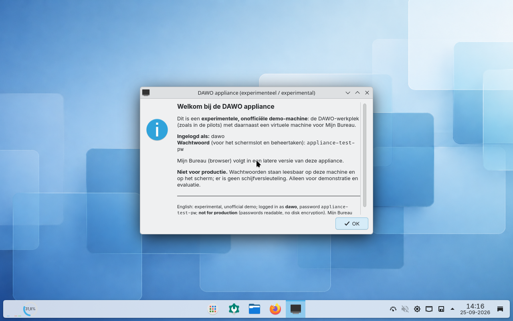
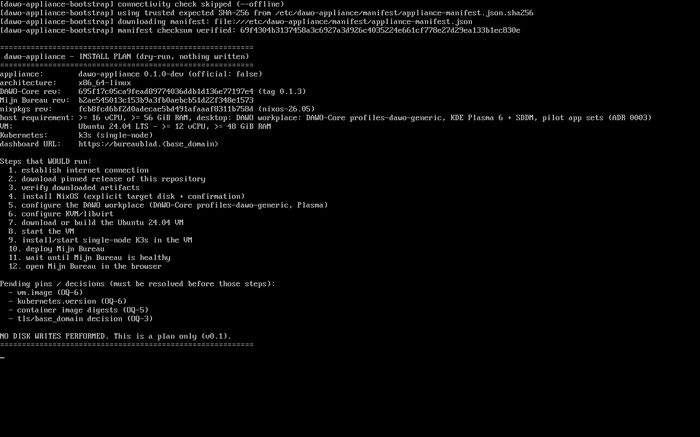

# dawo-appliance

> **Experimental and unofficial.** This is an independent experiment. It is
> **not** an official DAWO, Mijn Bureau, or Ministerie van BZK distribution and
> is not endorsed by them.

A reproducible appliance that demonstrates a **digitally autonomous government
workplace on one machine**. A small bootable installer ISO installs, after an
explicit and confirmed disk choice, the **DAWO workplace** (the NixOS-based
government desktop from [DAWO-Core](https://codeberg.org/DAWO/DAWO-Core), the
same profile a pilot laptop gets) with an Ubuntu 24.04 VM (KVM/libvirt),
single-node K3s inside it, a deployment of
[Mijn Bureau](https://code.overheid.nl/MinBZK/mijn-bureau-infra), a health check,
and the Mijn Bureau dashboard opened in the browser.

Why it exists, what it adds and what it costs: [`docs/purpose.md`](docs/purpose.md).
All documentation: [`docs/README.md`](docs/README.md).

## What it looks like



*The installed host after power-on: auto-login as `dawo` into the DAWO
workplace (DAWO-Core 0.1.3, KDE Plasma 6) plus the appliance's welcome dialog,
which shows the login password and says "not for production". Captured by the
boot test; the password in the picture is the test suite's throwaway one.*



*The live ISO after `dawo-appliance-bootstrap plan`: pinned versions, the twelve
steps that would run, and "NO DISK WRITES PERFORMED".*

Both pictures are captured by the automated boot tests of the pinned
configuration (software-rendered VM), never by hand. Provenance and rules:
[`docs/screenshots/`](docs/screenshots/README.md).

## Status

Built in vertical slices ([`docs/roadmap.md`](docs/roadmap.md)); each is
independently runnable. Session handoff: [`docs/STATUS.md`](docs/STATUS.md).

| Slice | What | State |
| --- | --- | --- |
| 0 | Scaffolding: pinned manifest + checksum, Nix flake/dev shell, bootstrap `plan`/`verify` | Done |
| 1 | Non-destructive live ISO + bootstrap dry-run | Done, verified |
| 2 | Host install to disk (disko, gated by `--target-disk` + `--confirm-destroy`); no LUKS in v0.1 | Done, verified |
| 2c | Upstream refresh: DAWO-Core 0.1.3, nixpkgs 26.05, mijn-bureau-infra 2026-07-27, ADR 0002/0003 | Done 2026-09-25 |
| 3 | DAWO workplace (`profiles-dawo-generic`, Plasma) + KVM/libvirt, parity check, `nix run .#appliance-vm` | Built 2026-09-25, boot-tested; visual review pending |
| 4 | Ubuntu 24.04 VM (libvirt + cloud-init) | Scaffolding |
| 5 | Single-node K3s in the VM | Scaffolding |
| 6 | Mijn Bureau (Helmfile) | Scaffolding, needs OQ-3 |
| 7 | Health check + auto-open browser | Scaffolding, needs OQ-3 |

**What works today:** `dawo-appliance-installer.iso` boots, brings up
networking, downloads and checksum-verifies the pinned manifest, prints the
install plan, and installs the host to an explicitly confirmed disk. That host
is the DAWO workplace (SDDM + KDE Plasma 6, the pilot app set, nl_NL, mandatory
hardening) with KVM/libvirt and an optional install-time generated password.
The VM, K3s, Mijn Bureau and the browser step (slices 4–7) are **not built
yet**, and running them end-to-end needs a large host (see below).

## Verification

One command runs every automated check: `bash scripts/verify.sh`. The result of
the **latest real run** is in
[`docs/verification-latest.md`](docs/verification-latest.md) (written only by
that script). What each check covers: [`docs/testing.md`](docs/testing.md).
A release is only a release when that file shows all checks green.

## Try it without installing

The installed host as a local QEMU VM (needs Linux with Nix, KVM, a display and
about 6 GiB RAM for the guest):

```bash
git clone https://github.com/EduardWitteveen/dawo-appliance
cd dawo-appliance
nix run .#appliance-vm
```

A QEMU window opens; the VM boots with the BZK splash, logs in automatically as
`dawo` and shows a welcome dialog with the login details. The first start
downloads the Plasma closure (several GB). On the Windows + WSL development
machine run it inside WSL from a directory on ext4, so the VM disk
(`dawo-appliance.qcow2`) does not land on `/mnt/c`. The real install path and
the development commands: [`docs/development.md`](docs/development.md).

## How long things take

Measured on the reference development machine so you can judge your own:

| Reference machine | |
| --- | --- |
| Laptop | Dell Latitude 5550, Intel Core i5-1345U (2 P-cores + 8 E-cores, 12 threads, 15 W class), Intel Iris Xe, SSD |
| RAM | 32 GB; WSL2 gets 24 GB and 12 CPUs (`.wslconfig`, since 2026-09-25) |
| Software | Windows 11, WSL2 Ubuntu-24.04, Nix 2.34.7, KVM in WSL, power plan "High performance", on AC |
| Network | about 10 MB/s (85 Mbit/s) download from the Nix cache |

| Task | First time (cold Nix store) | Later (warm store), measured 2026-09-25 |
| --- | --- | --- |
| `nix flake check` (eval, dry-run suite, shellcheck, parity) | 5–10 min after a pin bump (fetches inputs) | **43 s** |
| `nix build .#installer-iso` (1.4 GB ISO) | ~15 min | **82–86 s** |
| `nix build .#test-installer-boot` (boots the ISO payload in a VM) | ~5 min | **28–32 s** (guest reaches multi-user in 18 s) |
| `nix build .#test-appliance-boot` (downloads the Plasma + pilot-app closure, ~10 GB, first time) | **25–40 min** | **54–129 s**; inside the VM: Plasma session at 47 s, welcome dialog at 54 s after power-on |
| `nix build .#appliance-vm` | as above | **11–12 s** |
| `nix run .#appliance-vm`, to a usable desktop | as above plus ~1 min | ~1 min |
| `bash scripts/verify.sh` (everything, `FORCE=1`) | **45–60 min** | **~6 min** |

Per-run numbers with mean and range: [`docs/verification-latest.md`](docs/verification-latest.md)
and `docs/verification-history.csv`. The download speed dominates the first run.
**Before measuring anything, run `bash scripts/speed-check.sh`**: without a
usable `/dev/kvm` inside the Nix sandbox the VM tests silently fall back to
software emulation and take 4–8 minutes per boot ([`docs/testing.md`](docs/testing.md)).

## Scope (v0.1)

Supported: x86-64, online install, one physical machine, one Ubuntu 24.04 VM,
single-node K3s, Mijn Bureau, automatic start, a local health check, automatic
opening of the browser.

Out of scope: openDesk, Nextcloud AIO, multiple Kubernetes nodes, HA,
org-specific branding, Active Directory, offline installation, and fleet
management (imaging many laptops, auto-update, Secure Boot / TPM enrolment:
upstream's domain). Decisions: [`docs/adr/`](docs/adr/).

## Hardware requirement

Mijn Bureau's single-node deployment requires **>= 12 vCPU and >= 48 GiB RAM**
(upstream `prerequisites.md`). The VM that runs it must be that large, so the
**physical appliance host needs roughly >= 16 vCPU and >= 56–64 GiB RAM**.
A typical 16 GiB laptop can build and dry-run the installer and boot the host
in a VM, but cannot run the full stack (OQ-2).

## Upstream (consumed, not forked)

- **DAWO-Core** (formerly DAWO-NixOS): <https://codeberg.org/DAWO/DAWO-Core>,
  pinned to release `0.1.3`. Mirrors on code.overheid.nl and GitHub.
- **mijn-bureau-infra**: <https://code.overheid.nl/MinBZK/mijn-bureau-infra>,
  pinned to `b2ae545…` (2026-07-27).

Exact pins: [`manifest/appliance-manifest.json`](manifest/appliance-manifest.json)
and [`docs/upstream/revisions.md`](docs/upstream/revisions.md). The wider
ecosystem: [`docs/upstream/ecosystem.md`](docs/upstream/ecosystem.md). Upstream
ships its own headless fleet installer; ours is a different tool
([ADR 0002](docs/adr/0002-own-installer-iso.md)). The installed host is the
pilot workplace, unchanged, plus additions ([ADR 0003](docs/adr/0003-workplace-parity.md)).

## Repository layout

| Path | Purpose |
| --- | --- |
| `flake.nix`, `flake.lock` | Nix flake: packages, checks, boot tests, dev shell |
| `nix/` | Shared Nix code (workplace parity check) |
| `installer/` | Live installer ISO and the `dawo-appliance-bootstrap` command |
| `hosts/appliance/` | The installed host: DAWO workplace + additions |
| `hosts/profiles/disko/` | Explicit-target storage layout |
| `vm/`, `k8s/`, `apps/`, `health/` | Scaffolding for slices 4–7 (VM, K3s, Mijn Bureau, health check) |
| `manifest/` | Pinned release manifest + checksum |
| `scripts/` | `status.sh`, `verify.sh`, `speed-check.sh`, `screenshots.sh` |
| `tests/` | Local dry-run test suite (no Nix, no root, no network) |
| `docs/` | Documentation; start at [`docs/README.md`](docs/README.md) |

## Development

Start with `bash scripts/status.sh`, then [`docs/development.md`](docs/development.md).
Quick local gate without Nix or root: `make check`.

## License

**EUPL-1.2** (European Union Public Licence v. 1.2), see [`LICENSE`](LICENSE).
Aligns with Mijn Bureau (EUPL-1.2) and is compatible with DAWO-Core (GPL-3.0),
which the EUPL lists as a Compatible Licence. No secrets are stored in Git;
they are generated at install time ([`docs/architecture.md`](docs/architecture.md)).
