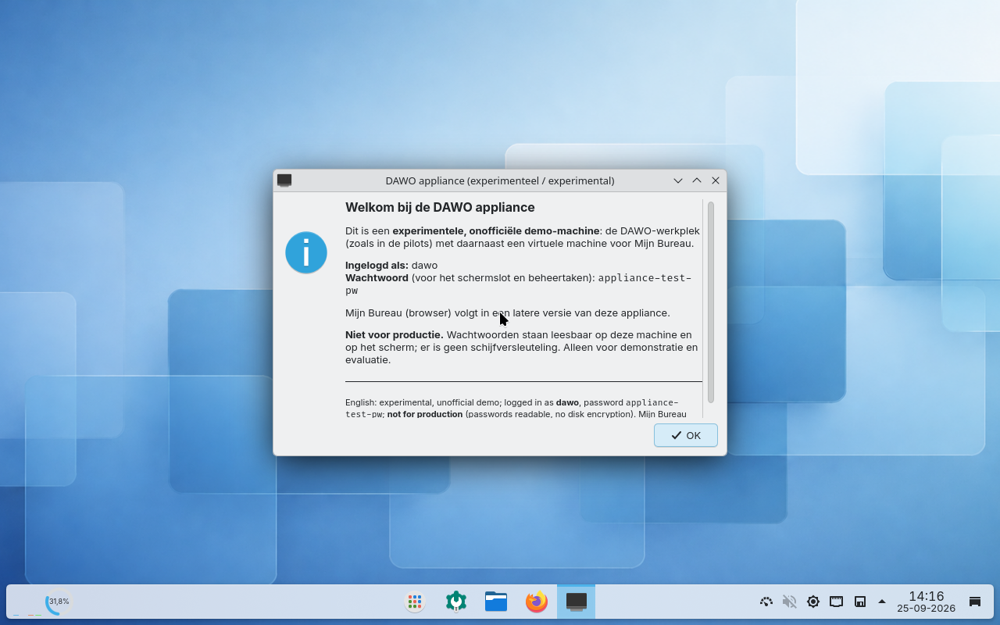
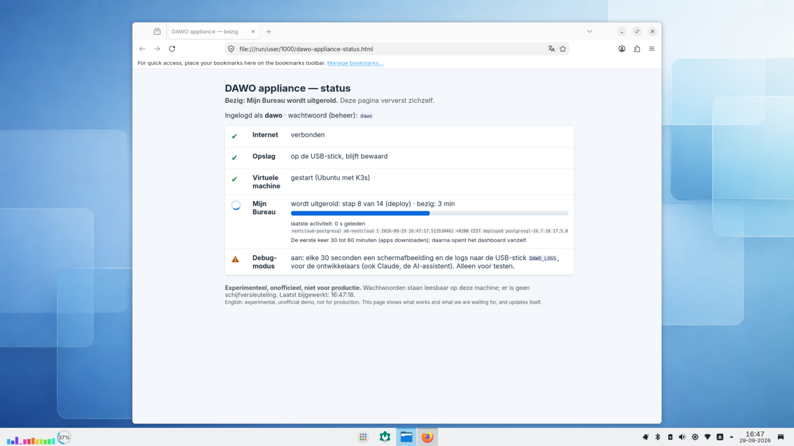
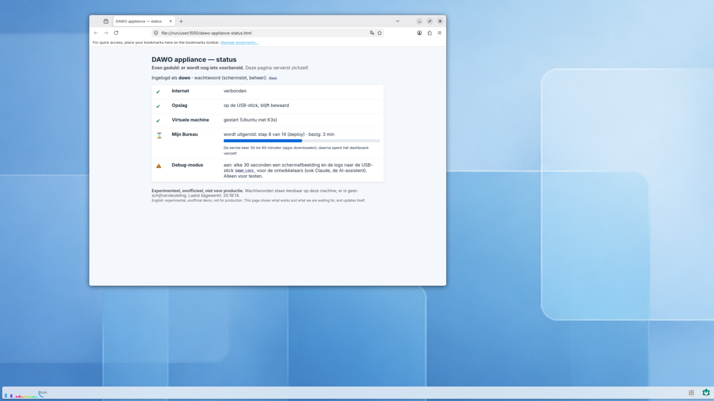
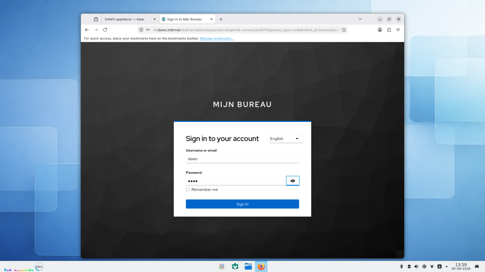
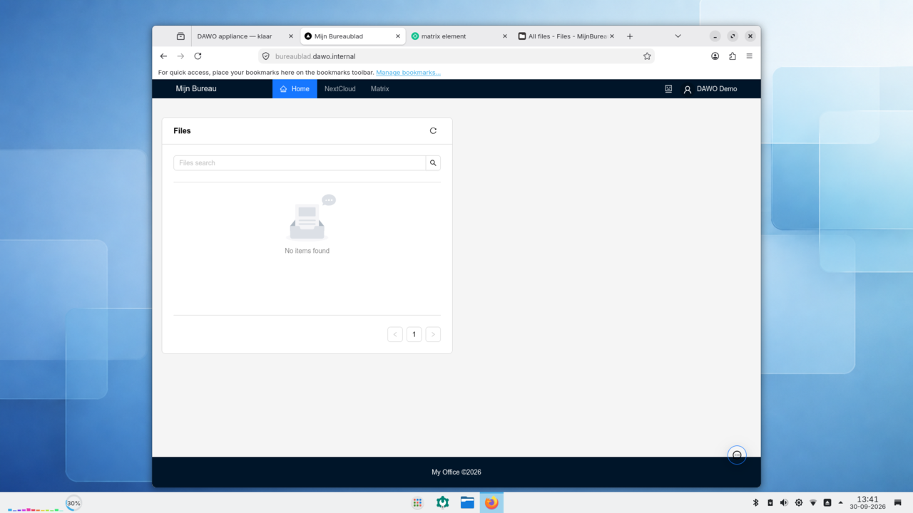
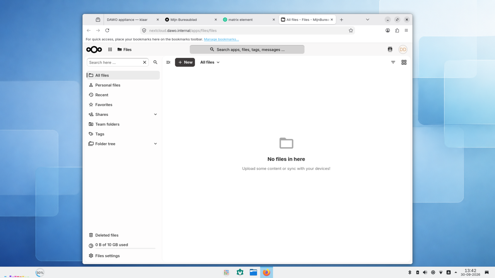
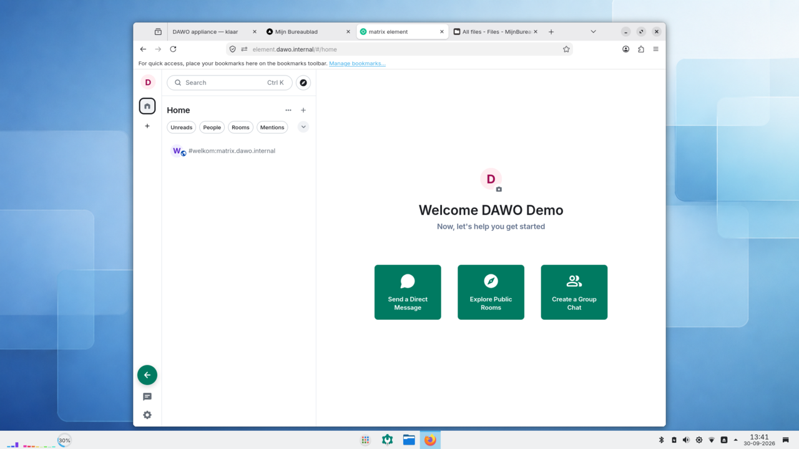
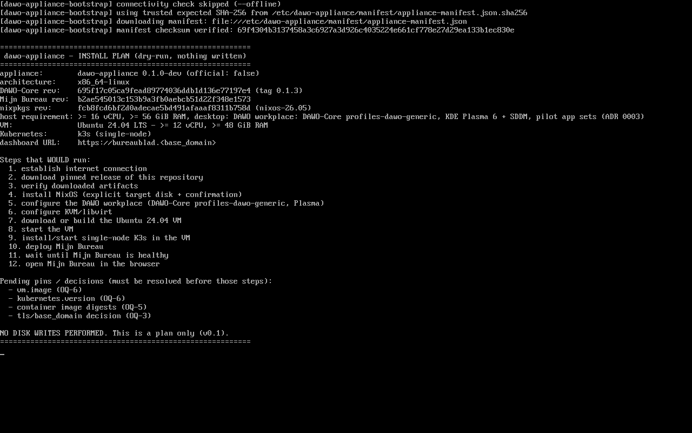

# dawo-appliance

<div align="center">

**Digitale Soevereiniteit in de Praktijk**  
*Een veilige, cloud-onafhankelijke werkplek voor de Nederlandse overheid—direct te testen op een afgeschreven laptop.*

[](#wat-is-dit)

[Bekijk het 5-minuten pitch script](docs/demo-script.md) | [Hardware Vereisten](docs/demo-hardware.md) | [Waarom bestaat dit project?](docs/purpose.md)

</div>

---

### 🇳🇱 Voor Gemeenten en Overheidsinstellingen (NL)
*(English technical documentation continues below)*

Gemeenten worstelen met *vendor lock-in* (zoals Microsoft 365) en strenge BIO-eisen rond data in de cloud. Dit open-source project maakt digitale soevereiniteit tastbaar: **steek een USB-schijf in een gewone laptop, zet hem aan, en je werkt op een complete overheidswerkplek.** Er verandert niets op de laptop zelf.

Op de USB-schijf staat alles:
1. **De werkplek (DAWO):** het veilige Linux-bureaublad uit de BZK-pilots, met dezelfde programma's.
2. **De samenwerkingssuite (Mijn Bureau):** een lokaal draaiend alternatief voor OneDrive, Teams en Office (Nextcloud, Collabora, Element), met één inlog.

**Het grote voordeel:** alle documenten en data blijven op de USB-schijf. Er gaat geen byte naar commerciële cloud-providers.

#### In beeld (echte schermafbeeldingen van een testlaptop)

| Mijn Bureau installeert zichzelf | De voortgang, stap voor stap |
| --- | --- |
| [](docs/screenshots/live-status-deploying.png) | [](docs/screenshots/live-status-page-dell.png) |
| Na het opstarten opent een statuspagina die laat zien wat werkt en waar het systeem op wacht. | Alle 14 stappen lukten op de testlaptop, in ongeveer 8 minuten. Daarna opent de knop Mijn Bureau. |

| Inloggen, één keer | Het dashboard Mijn Bureaublad |
| --- | --- |
| [](docs/screenshots/live-login-dell.png) | [](docs/screenshots/live-bureaublad-dell.png) |
| Inloggen met `dawo` / `dawo`. Deze ene inlog geldt voor alle apps. | Het startpunt: van hieruit open je bestanden en chat. |
| **Bestanden (Nextcloud)** | **Chat (Element)** |
| [](docs/screenshots/live-nextcloud-dell.png) | [](docs/screenshots/live-element-dell.png) |
| Het alternatief voor OneDrive. Documenten openen in Collabora (schermafbeelding volgt). | Het alternatief voor Teams-chat, op de open standaard Matrix. |

<sub>Gemaakt door de debug-modus van de USB-schijf op een Dell Latitude 5550, alleen bijgesneden (herkomst: [`docs/screenshots/HARDWARE.md`](docs/screenshots/HARDWARE.md)).</sub>

#### Stand van zaken (30 september 2026)

| | |
| --- | --- |
| ✅ **Werkt** | Opstarten van USB zonder de laptop te veranderen · werkplek na 20 seconden · virtuele machine en Kubernetes binnen een minuut · gegevens blijven bewaard · netjes afsluiten · statuspagina met voortgang |
| ✅ **Werkt** | Mijn Bureau installeert zichzelf helemaal: alle 14 stappen gelukt (ongeveer 8 minuten als de apps al gedownload zijn), inloggen werkt en het dashboard opent |
| ✅ **Werkt** | Inloggen met gebruikersnaam `dawo` en wachtwoord `dawo`; het dashboard Mijn Bureaublad, bestanden (Nextcloud) en chat (Element) openen met één inlog |
| ⏭️ **Daarna** | De demo doorlopen met het [demoscript](docs/demo-script.md) en schermafbeeldingen van de apps zelf |

De technische details per stap staan hieronder in het Engelse deel en in de [issues op GitHub](https://github.com/EduardWitteveen/dawo-appliance/issues).

#### Wat heb je nodig?

- Een laptop met **32 GB geheugen** en virtualisatie aan in de BIOS (met 8 GB start alleen de werkplek).
- Een **USB-SSD van 64 GB of meer**. Een gewone USB-stick slijt snel van het schrijfwerk van de virtuele machine.
- **Internet**, de eerste keer, om Mijn Bureau te downloaden (ongeveer 10 minuten).
- Meer: [hardware-vereisten](docs/demo-hardware.md) en [de USB-schijf maken](docs/live-usb.md).

Wat elke app van Mijn Bureau doet, zie je in de [rondleiding langs de apps](docs/audience/mijn-bureau-apps.md). Hoe de onderdelen samenhangen en waar je gegevens staan, lees je in de [functionele architectuur](docs/audience/functionele-architectuur.md).

**Veelgestelde vragen:**
- *Is dit officieel?* Nee, dit is een onafhankelijk experiment (v0.1) op basis van de officiële broncode van de Rijksoverheid.
- *Kan dit morgen in productie?* Nee, het is bedoeld voor evaluatie en bestuurlijke demo's. Wachtwoorden staan leesbaar op de schijf en er is geen versleuteling.

---

> **Experimental and unofficial.** This is an independent experiment. It is
> **not** an official DAWO, Mijn Bureau, or Ministerie van BZK distribution and
> is not endorsed by them.

A reproducible appliance that demonstrates a **digitally autonomous government
workplace on one machine**. A small bootable installer ISO installs, after an
explicit and confirmed disk choice, the **DAWO workplace** (the NixOS-based
government desktop from [DAWO-Core](https://codeberg.org/DAWO/DAWO-Core), the
same profile a pilot laptop gets) with an Ubuntu 24.04 VM (KVM/libvirt),
single-node K3s inside it, a deployment of
[Mijn Bureau](https://code.overheid.nl/MinBZK/mijn-bureau-infra), a health check,
and the Mijn Bureau dashboard opened in the browser.

Why it exists, what it adds and what it costs: [`docs/purpose.md`](docs/purpose.md).
All documentation: [`docs/README.md`](docs/README.md).

## What it looks like


*The installed host after power-on: auto-login as `dawo` into the DAWO
workplace (DAWO-Core 0.1.3, KDE Plasma 6) plus the appliance's welcome dialog,
which shows the login password and says "not for production". Captured by the
boot test; the password in the picture is the test suite's throwaway one.*



*The live ISO after `dawo-appliance-bootstrap plan`: pinned versions, the twelve
steps that would run, and "NO DISK WRITES PERFORMED".*

Both pictures are captured by the automated boot tests of the pinned
configuration (software-rendered VM), never by hand. The live USB on real
hardware is shown in the Dutch section above (debug-mode screenshots from the
stick, only cropped). Provenance and rules:
[`docs/screenshots/`](docs/screenshots/README.md).

## Status

Built in vertical slices ([`docs/roadmap.md`](docs/roadmap.md)); each is
independently runnable. Session handoff: [`docs/STATUS.md`](docs/STATUS.md).

| Slice | What | State |
| --- | --- | --- |
| 0 | Scaffolding: pinned manifest + checksum, Nix flake/dev shell, bootstrap `plan`/`verify` | Done |
| 1 | Non-destructive live ISO + bootstrap dry-run | Done, verified |
| 2 | Host install to disk (disko, gated by `--target-disk` + `--confirm-destroy`); no LUKS in v0.1 | Done, verified |
| 2c | Upstream refresh: DAWO-Core 0.1.3, nixpkgs 26.05, mijn-bureau-infra 2026-07-27, ADR 0002/0003 | Done 2026-09-25 |
| 3 | DAWO workplace (`profiles-dawo-generic`, Plasma) + KVM/libvirt, parity check, `nix run .#appliance-vm` | Built 2026-09-25, boot-tested; visual review pending |
| 4a | Ubuntu 24.04 VM: libvirt network + guest domain + cloud-init (`hosts/appliance/guest-vm.nix`) | Boot-tested (`test-guest-boot`, live tests); runs on real hardware (Dell, guest SSH after 26 s); firmware-crash reset under nested KVM (#24) |
| 4b | Per-install appliance CA + host/browser trust (`hosts/appliance/appliance-ca.nix`); CA cert+key transported into the guest at `/etc/dawo-appliance/{ca.crt,ca.key}` (issue #6) | Built 2026-09-25; guest CA transport added 2026-09-26, `nix flake check` passes; boot-test assertions written for both, not yet run on a KVM machine |
| 5 | Single-node K3s installer, pinned + offline-tested (`k8s/bootstrap/install-k3s.sh`) | Air-gap install boot-tested 2026-09-26: node Ready in the guest after 227 s (`test-guest-boot`, #7) |
| 6 | Mijn Bureau deploy driver (Helmfile, pinned rev) | Laptop profile (five core apps, `micro` preset; ADR 0007). On the live USB it deploys itself once K3s and internet are up. Dell, 2026-09-30 night (USB SSD): phases 1–13 passed (phase 8 `helmfile apply` 67–338 s, phase 11 in-cluster trust 148–405 s, phase 13 30 s once Collabora got its options as container args, #154). Phase 14 first got a 401 from Keycloak (our script sent the admin password with a trailing newline, #156); 2026-09-30 morning: **all 14 phases passed** in 438 s; 2026-09-30 afternoon (main ad68322, Bureaublad trusts the appliance CA, #163): 475 s, login as `dawo`/`dawo` reaches the Bureaublad dashboard, Nextcloud and Element via single sign-on |
| 7 | Health check + auto-open browser, offline-tested | First real pass on the Dell 2026-09-29: all 9 checks OK after 552 s. On the live USB the browser now opens only when the deployment is done (#143) |
| Live | Live USB: boot an existing laptop, disk untouched, data and debug logs on a `DAWO_LOGS` stick (ADR 0006, accepted) | KVM tests green 2026-09-28 (`test-live-iso-boot`, `test-live-iso-persist`: data reused across boots, clean power-off). Real hardware, Dell Latitude 5550, 2026-09-29, fresh USB SSD: desktop 23 s, guest SSH 37 s, K3s Ready 49 s; Mijn Bureau complete, all 14 phases (see row 6); a whole session writes about 1 GB to the stick (`io.txt`, #147). Dynabook (8 GB): desktop only, guest skipped as designed. The first SanDisk USB stick died after two days of VM writes (#139): use a USB SSD. Screenshots: [`HARDWARE.md`](docs/screenshots/HARDWARE.md) |

**What works today:** the **live USB** boots an existing laptop without touching
its disk: the DAWO workplace (SDDM + KDE Plasma 6, the pilot app set, nl_NL)
comes up in about 20 s, the Ubuntu guest and single-node K3s in under a minute
on a 32 GB laptop, and a self-updating status page shows what works and what
we are waiting for. Data (the guest disk) persists on the stick across boots.
Mijn Bureau's deployment starts by itself and has completed all 14 phases on real
hardware, including the full `helmfile apply`, certificates and the OIDC
restarts, Collabora and the Keycloak session lifetimes (Dell, 2026-09-30, 438 s
with the images already on the stick); the login works and the dashboard opens. The installer ISO
(Slices 1–2) installs the same host to an explicitly confirmed disk. Details
per slice: `docs/roadmap.md`; the live USB: [`docs/live-usb.md`](docs/live-usb.md).
Running Mijn Bureau needs a large host (see below).

**Found on real hardware, fixed with a check each** (live USB, Dell Latitude
5550, 2026-09-27..29): shutdown hang via Plasma's power-key handling (#115); a
2 h clock jump from `rtc_cmos` undoing the local-time RTC warp, which broke K3s
(#124); guest firmware/kernel crashes under nested KVM (#24, #119); phase
markers surviving a driver update (#131); upstream defaults that fail on a
laptop: Velero backups (#127) and Drive/Conversations (#134, found by an
offline `helmfile template` pre-flight); a KWallet wizard at autologin (#128);
the status page not showing progress (#132, #143); our digest check's
environment (#140); Collabora's liveness probe under the laptop profile's
limits, diagnosed from the guest disk copied off the stick (#150), whose real
cause was the distroless Collabora image ignoring upstream's `extra_params`
(#154, U4, reproduced locally); the phase-14 Keycloak password sent with a
trailing newline (#156). Upstream issues stay in our
tracker (label `upstream`, U-rows in [`docs/deviations.md`](docs/deviations.md)).

## Verification

One command runs every automated check: `bash scripts/verify.sh`. The result of
the **latest real run** is in
[`docs/verification-latest.md`](docs/verification-latest.md) (written only by
that script). What each check covers: [`docs/testing.md`](docs/testing.md).
A release is only a release when that file shows all checks green.

## Try it without installing

The installed host as a local QEMU VM (needs Linux with Nix, KVM, a display and
about 6 GiB RAM for the guest):

```bash
git clone https://github.com/EduardWitteveen/dawo-appliance
cd dawo-appliance
nix run .#appliance-vm
```

A QEMU window opens; the VM boots with the BZK splash, logs in automatically as
`dawo` and shows a welcome dialog with the login details. The first start
downloads the Plasma closure (several GB). On the Windows + WSL development
machine run it inside WSL from a directory on ext4, so the VM disk
(`dawo-appliance.qcow2`) does not land on `/mnt/c`. The real install path and
the development commands: [`docs/development.md`](docs/development.md).

## How long things take

Measured on the reference development machine so you can judge your own:

| Reference machine | |
| --- | --- |
| Laptop | Dell Latitude 5550, Intel Core i5-1345U (2 P-cores + 8 E-cores, 12 threads, 15 W class), Intel Iris Xe, SSD |
| RAM | 32 GB; WSL2 gets 24 GB and 12 CPUs (`.wslconfig`, since 2026-09-25) |
| Software | Windows 11, WSL2 Ubuntu-24.04, Nix 2.34.7, KVM in WSL, power plan "High performance", on AC |
| Network | about 10 MB/s (85 Mbit/s) download from the Nix cache |

| Task | First time (cold Nix store) | Later (warm store), measured 2026-09-25 |
| --- | --- | --- |
| `nix flake check` (eval, dry-run suite, shellcheck, parity) | 5–10 min after a pin bump (fetches inputs) | **43 s** |
| `nix build .#installer-iso` (1.4 GB ISO) | ~15 min | **82–86 s** |
| `nix build .#test-installer-boot` (boots the ISO payload in a VM) | ~5 min | **28–32 s** (guest reaches multi-user in 18 s) |
| `nix build .#test-appliance-boot` (downloads the Plasma + pilot-app closure, ~10 GB, first time) | **25–40 min** | **54–129 s**; inside the VM: Plasma session at 47 s, welcome dialog at 54 s after power-on |
| `nix build .#appliance-vm` | as above | **11–12 s** |
| `nix run .#appliance-vm`, to a usable desktop | as above plus ~1 min | ~1 min |
| `bash scripts/verify.sh` (everything, `FORCE=1`) | **45–60 min** | **~6 min** |

Per-run numbers with mean and range: [`docs/verification-latest.md`](docs/verification-latest.md)
and `docs/verification-history.csv`. The download speed dominates the first run.
**Before measuring anything, run `bash scripts/speed-check.sh`**: without a
usable `/dev/kvm` inside the Nix sandbox the VM tests silently fall back to
software emulation and take 4–8 minutes per boot ([`docs/testing.md`](docs/testing.md)).

## Scope (v0.1)

Supported: x86-64, online install, one physical machine, one Ubuntu 24.04 VM,
single-node K3s, Mijn Bureau, automatic start, a local health check, automatic
opening of the browser.

Out of scope: openDesk, Nextcloud AIO, multiple Kubernetes nodes, HA,
org-specific branding, Active Directory, offline installation, and fleet
management (imaging many laptops, auto-update, Secure Boot / TPM enrolment:
upstream's domain). Decisions: [`docs/adr/`](docs/adr/).

## Hardware requirement

Mijn Bureau's single-node deployment requires **>= 12 vCPU and >= 48 GiB RAM**
(upstream `prerequisites.md`). The VM that runs it must be that large, so the
**physical appliance host needs roughly >= 16 vCPU and >= 56–64 GiB RAM**.
A typical 16 GiB laptop can build and dry-run the installer and boot the host
in a VM, but cannot run the full stack (OQ-2).

## Upstream (consumed, not forked)

- **DAWO-Core** (formerly DAWO-NixOS): <https://codeberg.org/DAWO/DAWO-Core>,
  pinned to release `0.1.3`. Mirrors on code.overheid.nl and GitHub.
- **mijn-bureau-infra**: <https://code.overheid.nl/MinBZK/mijn-bureau-infra>,
  pinned to `b2ae545…` (2026-07-27).

Exact pins: [`manifest/appliance-manifest.json`](manifest/appliance-manifest.json)
and [`docs/upstream/revisions.md`](docs/upstream/revisions.md). The wider
ecosystem: [`docs/upstream/ecosystem.md`](docs/upstream/ecosystem.md). Upstream
ships its own headless fleet installer; ours is a different tool
([ADR 0002](docs/adr/0002-own-installer-iso.md)). The installed host is the
pilot workplace, unchanged, plus additions ([ADR 0003](docs/adr/0003-workplace-parity.md)).

## Repository layout

| Path | Purpose |
| --- | --- |
| `flake.nix`, `flake.lock` | Nix flake: packages, checks, boot tests, dev shell |
| `nix/` | Shared Nix code (workplace parity check) |
| `installer/` | Live installer ISO and the `dawo-appliance-bootstrap` command |
| `hosts/appliance/` | The installed host: DAWO workplace + additions |
| `hosts/profiles/disko/` | Explicit-target storage layout |
| `vm/`, `k8s/`, `apps/`, `health/` | Slices 4–7 (VM, K3s, Mijn Bureau, health check): written and (for K3s and health) offline-tested, not yet boot-tested or run end-to-end |
| `manifest/` | Pinned release manifest + checksum |
| `scripts/` | `status.sh`, `verify.sh`, `speed-check.sh`, `screenshots.sh` |
| `tests/` | Local dry-run test suite (no Nix, no root, no network) |
| `docs/` | Documentation; start at [`docs/README.md`](docs/README.md) |

## Development

Start with `bash scripts/status.sh`, then [`docs/development.md`](docs/development.md).
Quick local gate without Nix or root: `make check`.

## License

**EUPL-1.2** (European Union Public Licence v. 1.2), see [`LICENSE`](LICENSE).
Aligns with Mijn Bureau (EUPL-1.2) and is compatible with DAWO-Core (GPL-3.0),
which the EUPL lists as a Compatible Licence. No secrets are stored in Git;
they are generated at install time ([`docs/architecture.md`](docs/architecture.md)).
