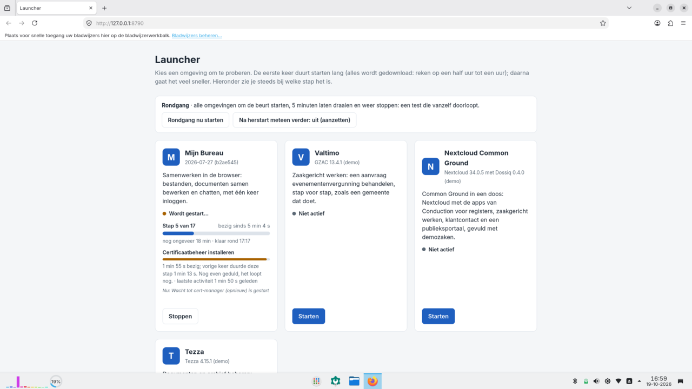
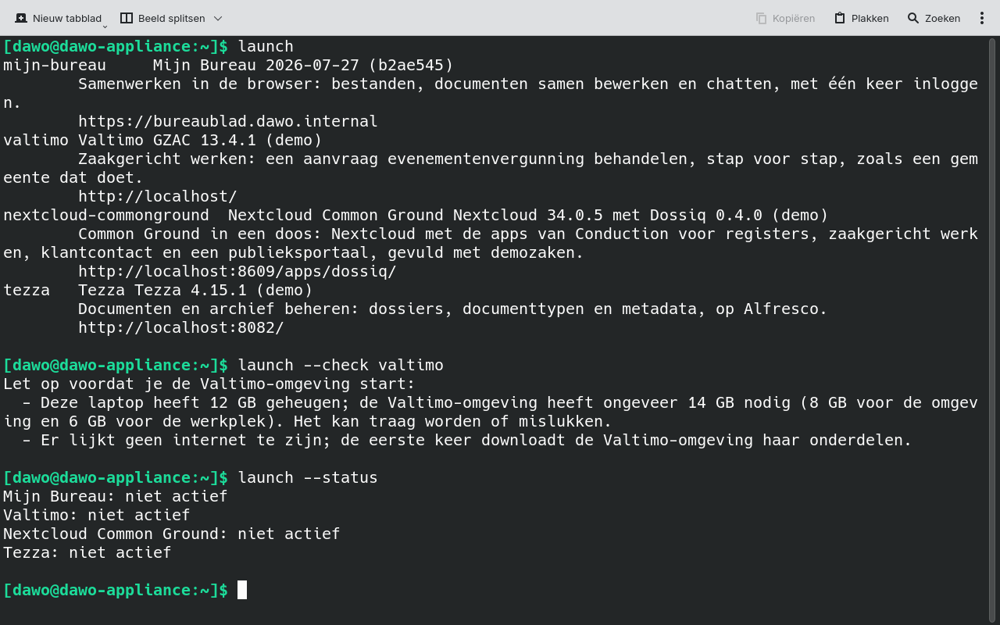
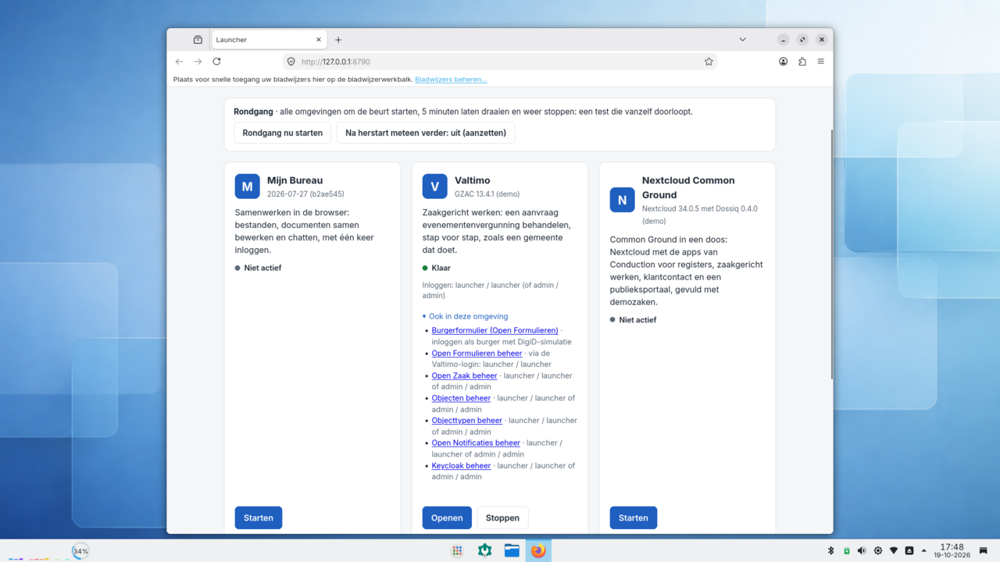
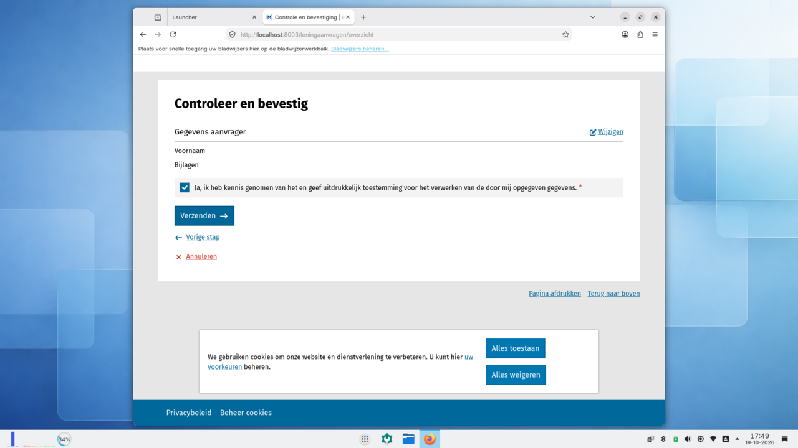
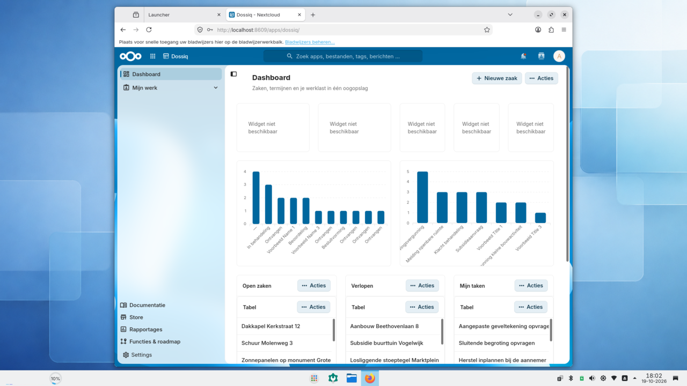
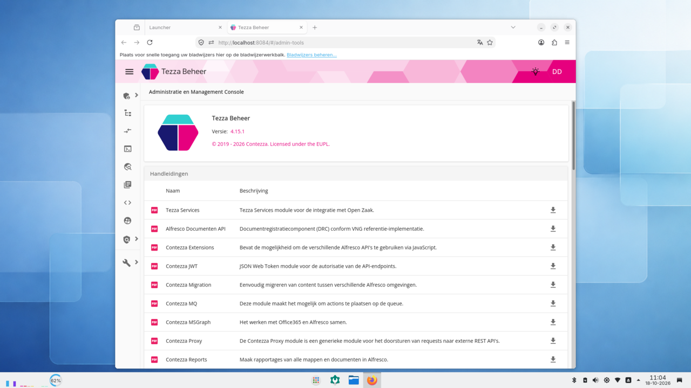

# dawo-appliance

**Een complete overheidswerkplek op een USB-schijf.** Steek hem in een laptop, zet hem aan en werk: bestanden, samen documenten bewerken, chatten en zaakgericht werken, zonder cloud. Er verandert niets op de laptop.

## Zelf proberen

1. **Download** het schijfbestand [`dawo-appliance-live.img`](https://sourceforge.net/projects/dawo-appliance/files/v0.1.0-rc.1/dawo-appliance-live.img/download) (versie 0.1.0-rc.1, 6,9 GB, via SourceForge) en controleer de [SHA-256](https://sourceforge.net/projects/dawo-appliance/files/v0.1.0-rc.1/) ([hoe](docs/live-usb.md)).
2. **Zet het op een USB-SSD** van 64 GB of meer, met [Rufus](https://rufus.ie) of [balenaEtcher](https://etcher.balena.io).
3. **Start de laptop van de USB-schijf.** De Launcher opent; kies een omgeving en klik **Starten**, of laat hem na een minuut vanzelf alle omgevingen om de beurt starten. Klaar? Klik **Openen**.

Je hebt een laptop met 32 GB geheugen nodig. Overal log je in met `launcher` / `launcher`. [Stap voor stap, met plaatjes →](docs/live-usb.md)

## Wat zit erin

| | |
| --- | --- |
|  **Eén keer inloggen** voor alles |  **Mijn Bureaublad**, het startpunt |
|  **Bestanden** (Nextcloud) |  **Samen documenten bewerken** (Collabora) |
|  **Chatten** (Element) |  **Ook vanaf de opdrachtregel:** `launch` |

**Meer omgevingen in de Launcher.** Elk gebruikt de standaard demo van de leverancier en wordt pas gedownload als je hem start.

| | |
| --- | --- |
|  **Valtimo** (zaakgericht werken) met Open Zaak, Objecten en Open Notificaties; de onderdelen staan met hun login op de kaart |  **Een burgerformulier** (Open Formulieren), inloggen met de DigiD-simulatie |
|  **Nextcloud Common Ground**: de apps van Conduction, zoals Dossiq, gevuld met demozaken |  **Tezza** (documenten en archief); let op: de licentie is onduidelijk, de Launcher waarschuwt eerst ([waarom](docs/audience/voor-gemeenten.md#veelgestelde-vragen)) |

Echte schermafbeeldingen van een testlaptop ([herkomst](docs/screenshots/HARDWARE.md)).

## Meer weten

- **Voor gemeenten:** waarom dit bestaat, wat werkt, wat je nodig hebt en veelgestelde vragen: [voor-gemeenten](docs/audience/voor-gemeenten.md)
- **Wat elke app doet:** [rondleiding langs de apps](docs/audience/mijn-bureau-apps.md)
- **Iets gezien of een idee?** [Laat het weten op GitHub](https://github.com/EduardWitteveen/dawo-appliance/issues/new)
- **Technical documentation (English):** [technical overview](docs/technical-overview.md) · [all documents](docs/README.md)

> **Experimenteel en onofficieel.** Een onafhankelijk experiment, geen officiële DAWO-, Mijn Bureau- of BZK-distributie. Niet voor productie. Licentie: [EUPL-1.2](LICENSE).
