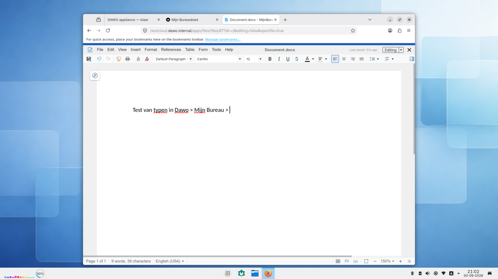

# Rondleiding: de apps van Mijn Bureau

*Voor iedereen die wil zien wat Mijn Bureau is voordat hij de demo start. Alle schermafbeeldingen komen van een echte testlaptop (Dell Latitude 5550, 30 september 2026), gestart van de USB-SSD. Herkomst: [`HARDWARE.md`](../screenshots/HARDWARE.md).*

> Experimenteel en onofficieel: geen distributie van DAWO, Mijn Bureau of het Ministerie van BZK. De demo heeft één gebruiker, `dawo`, met wachtwoord `dawo`.

Mijn Bureau is een samenwerkingssuite van open-source apps, samengesteld door het Ministerie van BZK. Je logt één keer in en hebt dan toegang tot alle apps. In deze demo draaien ze allemaal op de laptop zelf. Hoe dat werkt, staat in de [functionele architectuur](functionele-architectuur.md).

---

## Inloggen (Keycloak)

**Wat het is:** de centrale inlog voor alle apps. Na één keer inloggen open je de andere apps zonder opnieuw je wachtwoord te typen ("single sign-on").
**Vergelijkbaar met:** inloggen met je werkaccount bij Microsoft 365.
**In de demo:** je wordt vanzelf ingelogd als `dawo`, zodat je dit scherm meestal niet ziet. Zie je het toch, gebruik dan gebruikersnaam `dawo` en wachtwoord `dawo`. Er is geen koppeling met een bestaand accountsysteem.

## Het dashboard (Mijn Bureaublad)

**Wat het is:** de startpagina van Mijn Bureau. Bovenin staan de apps (NextCloud, Matrix); op de pagina zelf zie je een overzicht, zoals je recente bestanden.
**Vergelijkbaar met:** de startpagina van Microsoft 365.
**In de demo:** opent via de knop *Open Mijn Bureau* op de statuspagina.

## Bestanden (Nextcloud)

**Wat het is:** opslag voor je bestanden en gedeelde mappen. Je kunt bestanden uploaden, in mappen ordenen en delen met collega's.
**Vergelijkbaar met:** OneDrive en SharePoint.
**In de demo:** 10 GB ruimte voor de demogebruiker. De bestanden staan op de USB-SSD.

## Documenten bewerken (Collabora Online)

**Wat het is:** een kantoorpakket in de browser voor teksten, spreadsheets en presentaties. Het opent `.docx`-, `.xlsx`- en `.pptx`-bestanden, en meerdere mensen kunnen tegelijk in één document werken.
**Vergelijkbaar met:** Word, Excel en PowerPoint online.
**In de demo:** je opent het vanuit Nextcloud door op een document te klikken, of via *Nieuw* → document.

## Chat (Element)

**Wat het is:** chatten met collega's, één op één of in groepen ("ruimtes"). Element werkt met de open standaard Matrix, dat ook andere overheden gebruiken.
**Vergelijkbaar met:** de chat in Teams.
**In de demo:** er staat al een ruimte `#welkom` klaar. Met één gebruiker kun je niet met een ander chatten, maar wel ruimtes aanmaken en berichten plaatsen.

---

## In Mijn Bureau, maar niet in deze demo

Mijn Bureau kent meer apps. Die staan in deze demo uit, zodat alles past op één laptop met 32 GB geheugen ([ADR 0007](../adr/0007-mijn-bureau-laptop-profile.md)):

| App | Wat het doet |
| --- | --- |
| **Grist** | Slimme spreadsheets en kleine databases |
| **Docs** | Samen notities en teksten schrijven, zoals in een wiki |
| **Meet** (met LiveKit) | Videobellen |
